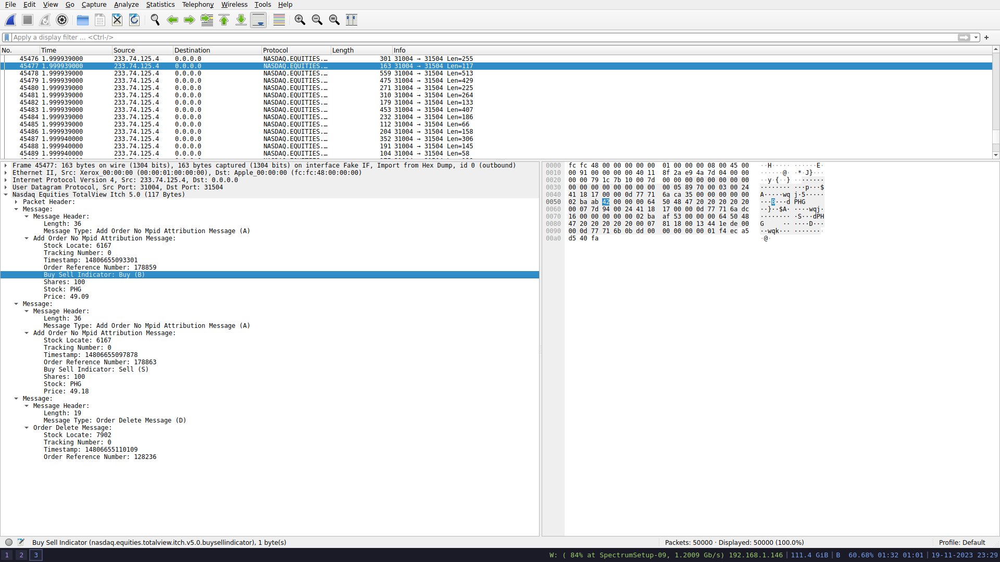

# Fake ITCH Nasdaq Server C library

Objective :

- read NASDAQ ITCH log and create fake MoldUDP64 packet to send over UDP

- keep track of sent ITCH packets within the session window

- respond to re-request requests with a new MoldUDP64 packet containing the requested messages
    
## Wireshark 

Library has wireshark integration such that each packet can be dumped 
to wireshark to help with debugging.
We are using the same packet `hex` format as the [`eth` library](https://github.com/Essenceia/ethernet_packet_C_lib/tree/master).

  

Credit goes to the [Open Markets Initiative for the Nasdaq Totalview 5.0 wireshark dissector.](https://github.com/Open-Markets-Initiative/wireshark-lua/tree/main) 
